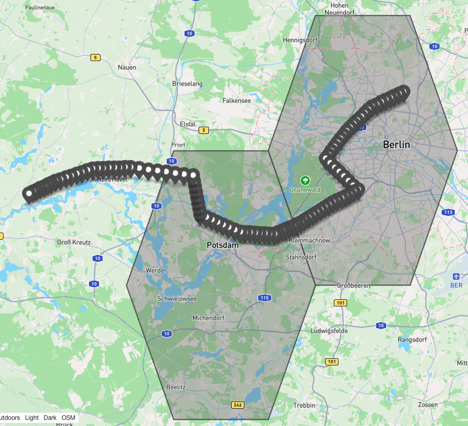

# Scenario One: Distance/Latency Change

Shows that the geo-distribution is transparent to moving clients by showing the latency footprint of handovers and client's distance to cloud/edge.


## Setup

### traffic control
we used linux's traffic control `tc` to add 5ms network latency (10ms round trip) for inter-Edge connection  
- run the `latency_setup.sh <net-interface> <other-broker-ip> <additional latency in ms>` 
- allow non-root user to run tc commands: `setcap cap_net_admin+ep /usr/sbin/tc`

### Client
- a moving client from Pankow region in Berlin to far west of Potsdam
- the client calls the sieve function once per location
### Servers
- We set a 5ms inter-edge artificial network latency (each trip)
- you can copy measurement files to local using scp: `scp "raspi-gamma:~/Documents/logs/*.csv" .`
- DisGB: 2 MessageProcessor threads, the default values
 <details>
     <summary>multiple marks GeoJSON placeholder:</summary>  

  ```json
  {
    "type": "FeatureCollection",
    "features": [
  
      
    ]
  }
  ```
  </details>

- Cloud
  - Location: `51.498593,-0.176959` (London)
    - cloud node in London (25ms ping). set the location to Imperial College London
  - Service Area:
    - Whole world
- TUBerlin
  - Location: `52.510057,13.325043`
  - Service Area: 
    - 12km circumcircle radius,
    <details>
    <summary>GeoJSON:</summary> 
    
    ```JSON 
    {
      "type": "Feature",
      "geometry": {
        "type": "Polygon",
        "coordinates": [
          [
            [
              13.235211471588048,
              52.354464419905504
            ],
            [
              13.414874528411953,
              52.354464419905504
            ],
            [
              13.504706056823904,
              52.510057
            ],
            [
              13.414874528411953,
              52.6656495800945
            ],
            [
              13.235211471588048,
              52.6656495800945
            ],
            [
              13.145379943176097,
              52.510057
            ],
            [
              13.235211471588048,
              52.354464419905504
            ]
          ]
        ]
      },
      "properties": {
        "ccid": {
          "q": 0,
          "r": 0,
          "s": 0
        },
        "centroid": {
          "longitude": 13.325043,
          "latitude": 52.510057
        },
        "circumradius": 20000,
        "inradius": 17320.508075688773
      }
    }
    ```
    </details>
  
- Potsdam
  - Location: `52.354199, 13.055874`
- Service Area: 
  - 12km circumcircle radius,
    <details>
      <summary>GeoJSON:</summary> 
    
    ```JSON
            {
            "type": "Feature",
            "geometry": {
                "type": "Polygon",
                "coordinates": [
                    [
                        [
                            12.966042471588047,
                            52.1986064199055
                        ],
                        [
                            13.145705528411952,
                            52.1986064199055
                        ],
                        [
                            13.235537056823903,
                            52.354199
                        ],
                        [
                            13.145705528411952,
                            52.5097915800945
                        ],
                        [
                            12.966042471588047,
                            52.5097915800945
                        ],
                        [
                            12.876210943176096,
                            52.354199
                        ],
                        [
                            12.966042471588047,
                            52.1986064199055
                        ]
                    ]
                ]
            },
            "properties": {
                  "ccid": {
                      "q": 0,
                      "r": 0,
                      "s": 0
                  },
                  "centroid": {
                      "longitude": 13.055874,
                      "latitude": 52.354199
                  },
                  "circumradius": 20000.0,
                  "inradius": 17320.508075688773
              }
          }
      ```
  </details>

##